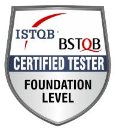

# Como vai? Bem-vindo(a)! 👋
### Me chamo Roberto 

- 👨‍💻 Hoje trabalho como QA para a Smiles/GOL, mas tenho uma profunda paixão por programação. Em geral, meu tempo livre em frente ao computador é dedicado a meus projetos e estudos.
- 📚 Atualmente estudo de forma avulsa Python, automação e desenvolvimento web. Também estou cursando segurança da informação no programa **[Hackers do bem](https://hackersdobem.org.br/)**
- Como QA, estou na área desde 2021, e estou certificado no ISTQB (CTFL - Certified Tester Foundation Level) 

-------------------------------------------------------------------------

 

